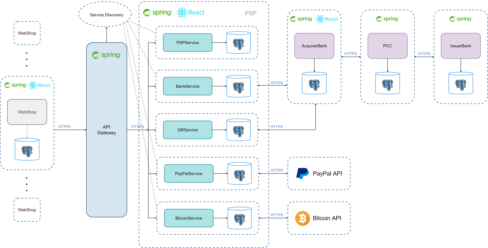

# Payment Systems

* This project allows client applications to make payments using the PSP (Payment Service Provider). 
* The payment methods that PSP provides are credit card, QR code, PayPal, Bitcoin.

## Architecture

